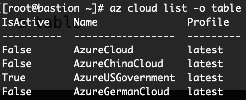

=== Introduction
-------
This is a step-by-step guide to allow OpenShift ACM to deploy a cluster to Azure Gov Cloud. Red Hat Advanced
Cluster Management for Kubernetes provides end-to-end management visibility and control to manage your Kubernetes
environment. Provides management capabilities for cluster creation, application lifecycle, and provide security
and compliance for all of them across data centers and hybrid cloud environments. Clusters and applications are
all visible and managed from a single console, with built-in security policies. Run your operations from anywhere
that Red Hat OpenShift runs, and manage any Kubernetes cluster in your fleet.
-------

.Assumptions:
  . Have the proper Microsoft Azure Gov credentials
    - The list of pre-reqs can be found here: https://access.redhat.com/documentation/en-us/openshift_container_platform/4.6/html-single/installing_on_azure/index#installing-azure-account
  . Have the 'az' cli tool for Azure installed on the bastion host
  . Have the 'oc' cli tool for OpenShift installed on the bastion host
  . Having direct access to the internet for the 'openshift-install' command to download the proper install configs
  .

.Installation:
 . Verify that you are attached to the proper Azure Cloud
   - Run `az cloud list -o table`
  
 . You will need to be attached to the "AzureUSGovernment" cloud - if you are not then type the following
   - `az cloud set --name AzureUSGovernment --profile latest`
   - This will set the 'IsActive' to the correct cloud provider by Azure
   - You will now see a "True" for "AzureUSGovernment" +

IMPORTANT: **If you do not have the proper Azure Cloud set the rest of the configuration will not work properly**
